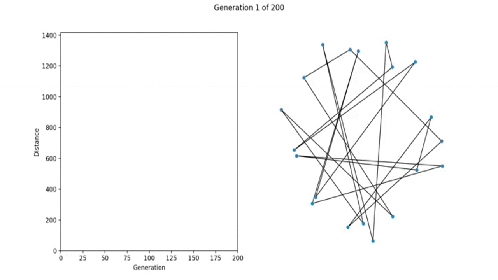

# Rust-Genetic

In this work it is suggested to consider the implementation of a prototype genetic algorithm for the traveling salesman problem using the Rust programming language.

The diploma thesis proposes the implementation of a flexible parameterized genetic algorithm for finding optimal solutions for the traveling salesman problem and a subprogram for visualizing the process of finding such solutions.

The developed algorithm can be used to investigate and solve other NP-complex problems with a given accuracy, each probability of genetic transition is parameterized and can be conveniently tuned to a specific problem.

A system of step-by-step visualization for the each step of population generation was developed, a visualization of the fitness function of each generation, which makes it easy to visually control the evolution of each generation of the genetic algorithm iteration and to select parameters for a more accurate solution of the problem.

# To run

```
cargo run ./config0.csv ./cities0.csv > ./output0.csv
```

# To plot
```
python3 plot.py ./cities0.csv ./output0.csv
```


